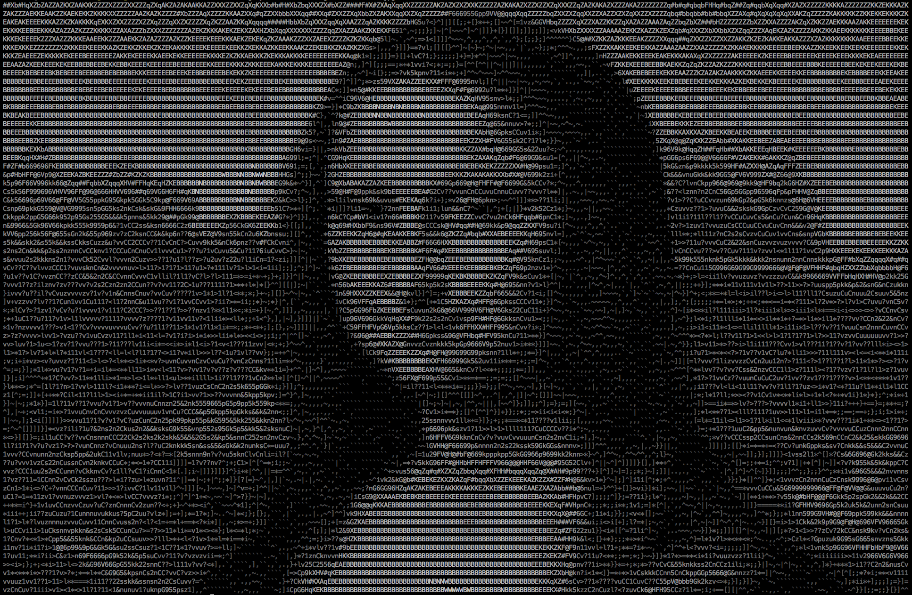

art
===

Simple command line tool for generating ASCII art. It's really just counting pixels.



Common usage:

```
art -mode=color -width=240 -height=70 -file=ml.jpg
```

If -file is omitted, all png and jpg files in the current folder will be processed. Skip pictures with return/enter.

Use find_suitable_ttfs.sh as inspiration to find suitable ttf font files on your system to calculate usable character mapping using
the -fontfile parameter.
If -fontfile is omitted the pre-calculated default mapping from artifacts.json will be used. If you use the -alphabet or the
-negative flag, you must provide a -fontfile value. If you don't, the included default ttf file will be used.

When providing your own alphabet try including or excluding white space. Smaller or consistent alphabets often give better results.

All parameters and their default values:

```
  -alphabet="ABCDEFGHIJKLMNOPQRSTUVWXYZabcedefghijklmnopqrstuvwxyz!@#$%^&*()-_=+1234567890[]{};':\",.<>/?\\|~` ": alphabet to use for art, if not set all printable ascii characters will be used
  -file="": filename of the image file (supported are png and jpeg), if omitted current directory will be scanned for files, skip from image to image with enter
  -height=80: height in characters
  -width=250: width in characters
  -mode="mono": mode can be mono, gray or color, default is mono
  -fontfile="fontfile.ttf": filename of a ttf font, preferably a monospaced one such as Courier
  -html=false: output html instead of ascii
  -negative=true: set to true if white text on black background, otherwise false
  -debug=false: if set to true some performance data will be printed
  -exact=false: require exact match for shade
```
